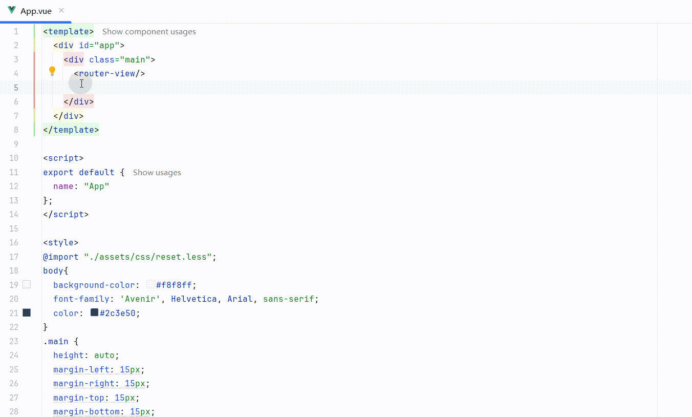

# elementPlugin IDEA 插件

## 为所有支持 JavaScript 的 JetBrains IDEs 提供 ElementUI 框架支持

#### 注意: 在使用插件之前,请先安装 [Vue.js 插件](https://plugins.jetbrains.com/plugin/9442-vue-js).

## 主要功能:
- 基于 ElementUI 2.15.14 版本
- 支持 ElementUI 标签智能提示补全
- 支持 ElementUI 标签文档提示
- 支持 ElementUI 标签属性智能提示补全
- 支持 ElementUI 标签属性文档提示
- 抑制 ElementUI 标签的 Unknown html tag 警告

#### 标签及属性输入智能提示补全



#### 标签悬浮文档提示


#### 属性悬浮文档提示


#### 实时模板


## 作者信息

- 作者博客：[知乎](https://www.zhihu.com/people/liang-yu-dong-44)
- 作者邮箱：375709770@qq.com
- github 地址：https://github.com/jufeng98

## 捐赠

如果项目帮到了您，请作者喝杯咖啡吧！


## 技术支持

微信记得备注 ```elementPlugin```，共同进步。
